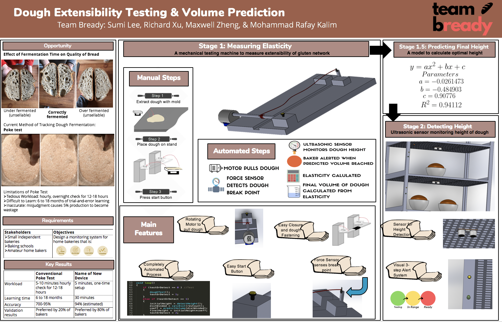
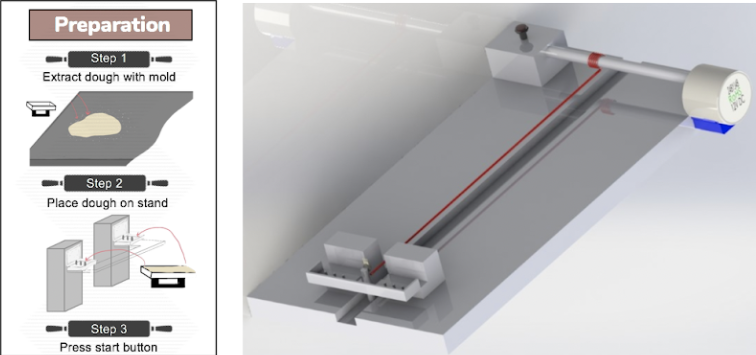
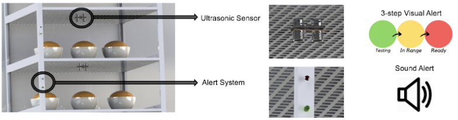

# Bready
An electromechanical solution to estimating dough fermentation.

     
    <em>Figure 1: Poster Summary</em>

## Motivation
Dough fermentation is a critical step in bread baking. It affects the volume, taste, and consistency of the baked bread. Underfermented and overfermented bread is marked as waste. 

Smaller bakeries without access to industrial resources rely on the "poke test" to determine whether a batch of dough has been properly fermented and is ready to bake. This test is very subjective and takes years to get right since it is based on personal intuition. It is hard to teach, and even harder to reach an acceptable margin of error for beginners. 

## Experimental Research
It is imperative to find a scientific relationship between the physical properties of the dough and the time required to ferment. This would eliminate the need for the intuition based "poke test" method. 

An indicator of dough that is properly fermented is the volume the dough takes up.
From a variety of experiments, it was determined that there was a strong correlation between the initial extensibility of the dough and the final its final volume once it has fully fermented. 

From these experiements, we designed a solution that first measures the extensibility of the dough and estimates the time remaining until it has reached the required volume. 

## Implementation 
### Step 1: Measuring Elasticity
1. A sample piece of dough is inserted into the device
2. The mechanical device pulls the dough and a force sensor detects when the dough breaks
3. A measurement of the distance extended is used to calculate the extensibility of the dough
4. The optimal final height is calculated

     
    <em>Figure 1: Measuring Elasticity</em> 

### Step 2: Detecting Height
1. Ultrasonic sensor monitors the height of the dough
2. Once the height is reached the user is alerted with auditory and visual stimuli

     
    <em>Figure 1: Detecting Height</em> 

